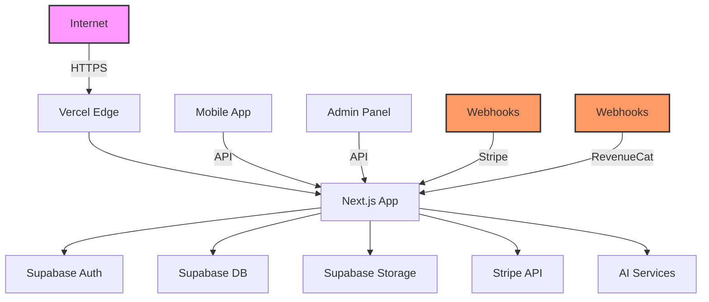

# MindScript Security Threat Model & Assessment

## Executive Summary

This comprehensive security assessment of the MindScript Phase 1 foundation code has identified **critical security vulnerabilities** that require immediate remediation. The most severe issues include exposed API keys in environment files (though marked as revoked), absence of security middleware, missing RLS policies, and lack of proper secrets management infrastructure.

**Overall Security Posture: HIGH RISK** - The application is not production-ready without implementing the security controls outlined in this document.

## Critical Findings

### 1. CRITICAL: Exposed Secrets & API Keys
- **Status**: Partially Mitigated (keys marked as revoked)
- **Impact**: Complete system compromise, data breach, financial loss
- **Evidence**: Service role keys and access tokens present in `.env` files
- **Required Actions**:
  1. Rotate ALL credentials immediately
  2. Implement proper secrets management (Vercel, Supabase Vault)
  3. Never commit `.env` files with real values
  4. Add pre-commit hooks to prevent secret exposure

### 2. CRITICAL: Missing Security Headers
- **Status**: Not Implemented
- **Impact**: XSS, clickjacking, MIME sniffing attacks
- **Evidence**: No security headers configuration in `next.config.js`
- **Required Actions**: Implement CSP, HSTS, X-Frame-Options, etc.

### 3. CRITICAL: No Authentication Middleware
- **Status**: Not Implemented
- **Impact**: Unauthorized access to protected resources
- **Evidence**: No middleware.ts file in web application
- **Required Actions**: Implement authentication checks on all protected routes

### 4. CRITICAL: Missing RLS Policies
- **Status**: Not Implemented
- **Impact**: Data leakage, unauthorized data access/modification
- **Evidence**: No SQL migration files or RLS policy definitions found
- **Required Actions**: Implement RLS on all Supabase tables

## Threat Model (STRIDE Analysis)

### Attack Surface

### Threat Categories

#### 1. Spoofing Identity
- **Threat**: Attackers impersonating legitimate users
- **Attack Vectors**:
  - Stolen JWT tokens
  - Session hijacking
  - CSRF attacks
- **Mitigations**:
  - Implement secure session management
  - Add CSRF protection
  - Use secure, httpOnly, sameSite cookies

#### 2. Tampering with Data
- **Threat**: Unauthorized modification of audio projects, scripts, user data
- **Attack Vectors**:
  - Direct database access (missing RLS)
  - API parameter manipulation
  - Race conditions in payment processing
- **Mitigations**:
  - Implement comprehensive RLS policies
  - Add input validation on all endpoints
  - Implement idempotency for payments

#### 3. Repudiation
- **Threat**: Users denying actions they performed
- **Attack Vectors**:
  - Lack of audit logging
  - Missing transaction records
- **Mitigations**:
  - Implement comprehensive audit logging
  - Store immutable transaction records
  - Add request tracing

#### 4. Information Disclosure
- **Threat**: Exposure of sensitive data
- **Attack Vectors**:
  - Exposed API keys (IDENTIFIED)
  - Missing access controls
  - Verbose error messages
  - Unencrypted PII storage
- **Mitigations**:
  - Encrypt sensitive data at rest
  - Implement proper error handling
  - Add data classification and handling policies

#### 5. Denial of Service
- **Threat**: Service unavailability
- **Attack Vectors**:
  - No rate limiting
  - Resource exhaustion (audio rendering)
  - Database connection exhaustion
- **Mitigations**:
  - Implement rate limiting
  - Add request throttling
  - Use connection pooling
  - Implement circuit breakers

#### 6. Elevation of Privilege
- **Threat**: Gaining unauthorized permissions
- **Attack Vectors**:
  - Missing authorization checks
  - JWT manipulation
  - Role escalation
- **Mitigations**:
  - Implement RBAC
  - Validate JWT signatures
  - Use principle of least privilege

## High-Risk Scenarios

### Scenario 1: Payment Manipulation
**Attack**: Modify price data client-side before checkout
**Impact**: Financial loss
**Likelihood**: High
**Mitigation**: Server-side price validation, webhook signature verification

### Scenario 2: Audio Injection Attack
**Attack**: Upload malicious audio files to exploit FFmpeg
**Impact**: Remote code execution
**Likelihood**: Medium
**Mitigation**: File type validation, sandboxed processing, FFmpeg security updates

### Scenario 3: Database Exfiltration
**Attack**: Direct database access due to missing RLS
**Impact**: Complete data breach
**Likelihood**: High (if service key exposed)
**Mitigation**: Implement RLS, rotate keys, audit access logs

### Scenario 4: Webhook Replay Attack
**Attack**: Replay payment webhooks to grant unauthorized access
**Impact**: Revenue loss, unauthorized premium access
**Likelihood**: Medium
**Mitigation**: Implement idempotency keys, timestamp validation

## Risk Assessment Matrix

| Vulnerability | Impact | Likelihood | Risk Level | Priority |
|--------------|--------|------------|------------|----------|
| Exposed Service Keys | Critical | High | CRITICAL | P0 |
| Missing RLS Policies | Critical | High | CRITICAL | P0 |
| No Security Headers | High | High | HIGH | P1 |
| Missing Auth Middleware | High | High | HIGH | P1 |
| No Rate Limiting | Medium | High | MEDIUM | P2 |
| No Webhook Security | High | Medium | MEDIUM | P2 |
| Missing Input Validation | Medium | Medium | MEDIUM | P2 |
| No Dependency Scanning | Medium | Low | LOW | P3 |

## Security Implementation Roadmap

### Phase 1: Critical Security (Immediate - 24 hours)
1. Rotate all exposed credentials
2. Implement environment variable encryption
3. Add basic authentication middleware
4. Deploy security headers

### Phase 2: Core Security (Week 1)
1. Implement comprehensive RLS policies
2. Add webhook signature verification
3. Implement rate limiting
4. Add input validation on all routes

### Phase 3: Enhanced Security (Week 2)
1. Implement comprehensive audit logging
2. Add security monitoring and alerting
3. Implement SIEM integration
4. Add penetration testing

### Phase 4: Ongoing Security (Continuous)
1. Regular security audits
2. Dependency updates
3. Security training
4. Incident response planning

## Security Testing Recommendations

### Unit Tests Required
- RLS policy validation tests
- Authentication middleware tests
- Input validation tests
- Webhook signature verification tests

### Integration Tests Required
- End-to-end authentication flows
- Payment processing with edge cases
- File upload security validation
- API rate limiting verification

### Security Scanning
- Static Application Security Testing (SAST)
- Dynamic Application Security Testing (DAST)
- Software Composition Analysis (SCA)
- Infrastructure as Code scanning

## Compliance Considerations

### GDPR Requirements
- Data encryption at rest
- Right to erasure implementation
- Data portability features
- Privacy policy and consent management

### PCI DSS (if storing card data)
- Network segmentation
- Encryption of cardholder data
- Access control measures
- Regular security testing

### SOC 2 Type II
- Security controls documentation
- Audit trail implementation
- Change management processes
- Incident response procedures

## Incident Response Plan

### Detection
- Implement security monitoring (Sentry, Datadog)
- Set up alerting for suspicious activities
- Regular log analysis

### Response
1. Isolate affected systems
2. Assess scope of breach
3. Preserve evidence
4. Notify stakeholders
5. Implement fixes

### Recovery
1. Restore from secure backups
2. Verify system integrity
3. Update security controls
4. Document lessons learned

## Security Contacts

For security issues, researchers should contact:
- Email: security@mindscript.app (to be created)
- Response time: Within 24 hours for critical issues
- Bug bounty program: Consider implementing via HackerOne

## Appendix: Security Checklist

### Before Production Launch

- [ ] All credentials rotated and secured
- [ ] RLS policies implemented and tested
- [ ] Security headers configured
- [ ] Rate limiting implemented
- [ ] Webhook security verified
- [ ] Input validation complete
- [ ] Authentication middleware deployed
- [ ] Audit logging enabled
- [ ] Security monitoring active
- [ ] Incident response plan tested
- [ ] Security training completed
- [ ] Penetration testing performed
- [ ] Compliance requirements met
- [ ] Security.txt file deployed
- [ ] Bug bounty program considered

## Conclusion

The MindScript platform has significant security vulnerabilities that must be addressed before production deployment. The exposed service keys (though marked as revoked) indicate a critical need for proper secrets management. The absence of RLS policies, security headers, and authentication middleware creates multiple attack vectors that could lead to data breaches and financial losses.

Immediate action is required on the P0 and P1 items identified in this assessment. Following the implementation roadmap will bring the application to an acceptable security baseline for production use.

Regular security audits and continuous monitoring will be essential for maintaining security posture as the platform evolves.